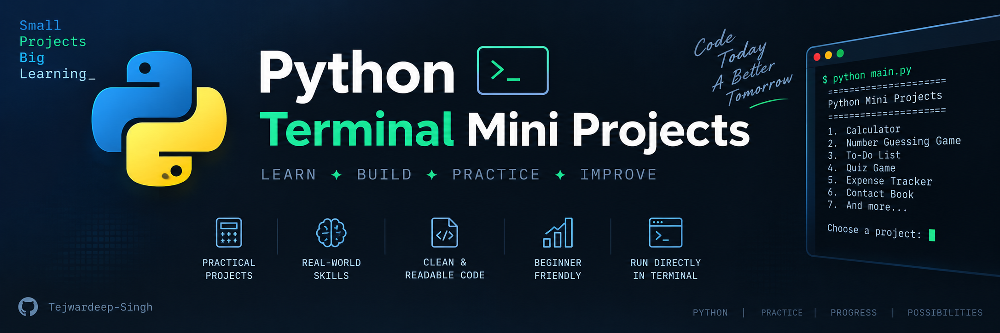

<p align="center">
  
</p>

<h1 align="center">🐍 Python Terminal Mini Projects</h1>

<p align="center">
  A collection of Python CLI projects built to practice programming,
  problem-solving, and Python fundamentals.
</p>

A collection of **small Python-based terminal/command-line projects** created to practice programming fundamentals, problem-solving, logic building, and Python concepts.

These projects are designed to start simple and gradually introduce more programming concepts through practical applications.

---

## 📌 About This Repository

This repository contains various **Python mini projects that run directly in the terminal**.

The main goal is to learn Python by building small, functional programs rather than only studying theoretical concepts.

### 🎯 Goals

* Learn and practice Python fundamentals
* Improve problem-solving skills
* Understand control flow and functions
* Practice working with lists, dictionaries, and strings
* Learn file handling
* Work with modules and libraries
* Build command-line applications
* Develop clean and readable code

---


---

## 🛠️ Technologies Used

* **Python 3**
* Python Standard Library
* Terminal / Command Prompt

No external frameworks are required for most projects.

---


## 🧠 Python Concepts Practiced

Throughout these projects, the following concepts are practiced:

### Basics

* Variables
* Data Types
* Input and Output
* Type Conversion
* Operators

### Control Flow

* `if`, `elif`, `else`
* `for` loops
* `while` loops
* `break`
* `continue`

### Data Structures

* Lists
* Tuples
* Sets
* Dictionaries
* Strings

### Functions

* Function creation
* Parameters and arguments
* Return values
* Scope

### Advanced Concepts

Depending on the project:

* File Handling
* Exception Handling
* Modules
* Randomization
* Date & Time
* Object-Oriented Programming
* CRUD Operations
* Data Persistence

---


## 📈 Learning Progress

This repository is also a record of my progress while learning Python.

Projects may become more complex over time as new concepts are introduced.

```text
Python Basics
     ↓
Control Flow
     ↓
Functions
     ↓
Data Structures
     ↓
File Handling
     ↓
Exception Handling
     ↓
OOP
     ↓
Larger CLI Applications
```

---

## 🔮 Future Improvements

Planned improvements include:

* [ ] Add more terminal projects
* [ ] Add Object-Oriented Python projects
* [ ] Add projects using file/database storage
* [ ] Improve error handling
* [ ] Add unit tests
* [ ] Add project-specific documentation
* [ ] Add more advanced CLI applications

---

## 🤝 Contributions

This repository is primarily created for learning and practice.

Suggestions, improvements, and new project ideas are welcome.

If you find an issue or have an improvement, feel free to open an **Issue** or submit a **Pull Request**.

---

## 👨‍💻 Author

**Tejwardeep Singh**

Computer Science & Engineering Student

GitHub: **[@Tejwardeep-Singh](https://github.com/Tejwardeep-Singh)**

---

## ⭐ Support

If you find this repository useful for learning Python, consider giving it a ⭐ on GitHub!

---

### 🐍 Keep Coding. Keep Building. Keep Learning.
